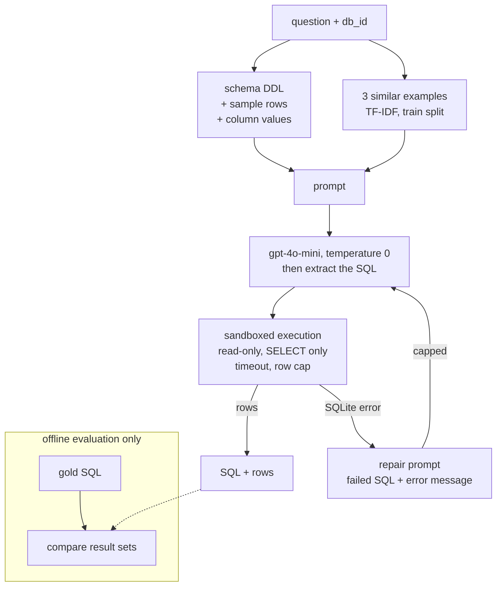

# Text-to-SQL Agent with Execution-Feedback Repair

Ask a database a question in English, get SQL, run it safely, get rows back —
and measure, one change at a time, what each part of the system is worth.

- **72.0% → 79.0% execution accuracy** on the full Spider dev set (1,034
  questions, `gpt-4o-mini`, temperature 0): 73 more questions right, McNemar
  p < 0.001, across a four-stage ablation.
- **Execute-and-repair** took invalid SQL from 33 queries to 0 — 23 fixed,
  0 broken.
- **Sandboxed execution**: generated SQL runs read-only, SELECT-only,
  time-bounded and row-capped. A prompt-injected `DROP TABLE` is a tested no-op.
- **Served over FastAPI** at 666 ms p50 with live model calls, 97% of it spent
  waiting on the model.

No LangChain, no LlamaIndex: the prompt that goes to the model is built in this
repo and readable verbatim in the response cache on disk.

The evaluator was built and validated before any model was called, and that
paid for itself — the first bug it caught was in the harness, not the model
([NOTES.md](NOTES.md#the-row-cap-was-set-by-guessing-and-a-test-caught-it)).

## How it works



The schema is the database's own `CREATE TABLE` statements, plus three sample
rows per table and the full value list of every text column with 20 or fewer
distinct values. Three question/SQL pairs are retrieved from Spider's training
split, whose databases never overlap with dev. If SQLite rejects the query, the
model gets its failed query and the exact error message back and tries again.

The repair loop only ever sees the predicted query's own execution result. The
gold query is used afterwards, to score — never inside the loop.

## Results

| stage | full dev (1,034) | vs. previous | McNemar p | LLM calls / q |
|-------|------------------|--------------|-----------|---------------|
| baseline — schema DDL + question | 72.0% | — | — | 1.000 |
| + two sentences about which columns to return | 74.2% | +2.2 pts | 0.010 | 1.000 |
| + sample rows & column values in the schema | 75.9% | +1.7 pts | 0.054 | 1.000 |
| + 3 retrieved question/SQL examples | 76.8% | +0.9 pts | 0.467 | 1.000 |
| + repair on execution error | **79.0%** | **+2.2 pts** | **< 0.001** | 1.034 |

744 → 817 correct overall. Each stage changes one thing, and the configuration
of each stage was fixed before its full-dev run.

**Differences are tested, not eyeballed.** Two runs answer the same questions,
so the comparison is paired: McNemar's exact test on the questions where they
disagree. Two middle rows do not clear significance on their own. They are
kept because every variant of each pointed the same way, and flagged in
[results.md](results.md) with their cost — the sample-values row nearly triples
the prompt.

**Prompts were tuned on a 200-question slice, not the reported set.** The slice
is stratified across all 20 dev databases. The obvious alternative, the first
200 questions, covers 4 databases and is 46% the hardest one — it scores 7.5
points below the full set, and tuning on it would have meant tuning mostly on
that one database.

**Each stage is also scored on the error it was aimed at**, not just the
headline. That is how it shows that one of stage two's two sentences recovered
59% of its target errors while the other recovered 14%, and that stage three's
longer prompt made both of them measurably weaker.

**The repair loop is the only stage with no regressions — 23 fixed, 0 broken —
and that is structural.** Every prompt change alters the input for all 1,034
questions and broke between 25 and 56 of them while fixing more. Repair only
touches a query that already failed to execute, which is always scored wrong,
so it cannot turn a right answer into a wrong one.

It is capped at two attempts, and the data says one is enough: 23 correct after
the first repair, still 23 after the second. The cap bounds the latency tail;
it does not buy accuracy here.

**45 questions still return exactly the right data in the wrong column order**,
measured exactly by trying every reordering of the predicted columns. Across
four stages that count went 51, 44, 46, 45. Neither describing the convention
nor demonstrating it with examples moved it.

Per-stage numbers, per-database accuracy, latency and the per-question records
are in [results.md](results.md).

## What the failures actually are

50 of the baseline's 290 failures, sampled across all 20 databases and
classified by hand — question, both queries and both result sets, read one at a
time.

| category | n | what it points to |
|----------|---|-------------------|
| wrong column order | 12 | instruction: order columns as the question names them |
| extra column returned | 8 | instruction: return only the columns asked for |
| **gold is questionable** | **7** | **nothing — the benchmark is wrong** |
| literal doesn't match stored value | 6 | sample values in the prompt |
| wrong column chosen | 5 | sample values in the prompt |
| query logic | 4 | self-consistency |
| wrong join path | 3 | foreign keys stated in the prompt |
| missing DISTINCT | 2 | retrieved few-shot examples |
| other | 3 | |

What came out of it:

- **40% of failures are about which columns come back**, not about
  understanding the question. `SELECT count(*), director` against
  `SELECT director, COUNT(*)` — same rows, same numbers, scored wrong.
- **The evaluator's own reason codes can't tell you what to fix.** Its
  `value_mismatch` code covers 232 of the 290 failures and turned out to span
  six hand categories with six different fixes.
- **The ceiling is not 100%.** 16% of sampled failures aren't the model's
  mistake. "How many states are there?" has a gold query that counts area-code
  rows and answers 305; the prediction's `COUNT(DISTINCT state)` answers 51.
  That is roughly 46 dev questions — a soft ceiling near 95%.

One pattern from the sample did not survive checking. Gold looked
aggregate-first in all twelve column-order failures, but across the 7,000
training queries it is group-key-first 69% of the time. A sample of failures is
selected for disagreement, so it could only ever look that way
([NOTES.md](NOTES.md)). What does hold is that gold follows the question's word
order 74% of the time, which is what the instruction was based on.

## Serving

`POST /query` takes `{db_id, question}` and returns the SQL, the rows, whether
a repair was needed, and where the time went. It serves the stage-five
configuration with a one-repair cap, since one and two measured identically.

100 requests across all 20 dev databases, 10 concurrent, one process on a
laptop:

| | cold — every call live | warm — responses cached |
|---|---|---|
| p50 | **666 ms** | 36 ms |
| p95 | 2,317 ms | 118 ms |
| share of server time in the model | 97% | 11% |
| HTTP errors | 0 | 0 |

**Cold is what a user waits.** Warm is this code's own overhead, with the model
call reduced to a disk read; quoting only that number would describe a service
no real question ever gets. Served answers match the offline evaluation on all
100 questions, so the code path that is deployed is the one that was measured.

Every input is treated as hostile. `db_id` is checked against the databases
that exist rather than turned into a path, so `../../somewhere` is a 404. The
question is length-capped. And the SQL is model output: a question that talks
the model into `DROP TABLE` gets back a rejected query, not a dropped table, and
`test_a_prompt_injected_drop_table_cannot_write` counts the table's rows
afterwards to prove it.

## How the metric is validated

Execution accuracy is the right metric — string-matching SQL scores every
valid paraphrase wrong — but a metric that hasn't been tested is just a number
generator. So it was checked in both directions across the whole dev set before
any model was run:

| pass | what it does | expected | measured |
|------|--------------|----------|----------|
| identity | score gold against itself | 100% | **100%** (1034/1034) |
| rewrite | wrap gold in `SELECT * FROM (...)`, renaming every column | ~100% | **100%** (803/803) |
| mutation | truncate gold's result with `LIMIT 1` | ~0% | **0%** (0/454) |

The rewrite pass fails if the metric is secretly comparing SQL text or column
names. The mutation pass fails if it is lenient enough to match anything.

## How execution is sandboxed

**It cannot write.** The connection is read-only (`file:...?mode=ro`). A guard
independently rejects anything that isn't a single `SELECT`/`WITH` — which also
blocks `ATTACH`, a way to open a second, writable database around the read-only
handle. Python's driver refuses multi-statement strings, so
`SELECT 1; DROP TABLE t` can't get through. The guard strips comments first,
quote-aware, so a `DROP` hidden behind `--` is still caught.

**It cannot hang.** A SQLite progress handler aborts the query once its deadline
passes; that is what actually stops a runaway cartesian product, since a Python
thread can't be killed from outside. Results are capped at 100k rows, because a
fast query returning ten million rows exhausts memory as surely as a slow one.

---

## Running it

```bash
pip install -r requirements.txt
```

```bash
python scripts/00_prepare_data.py
```

Downloads Spider 1.0 (~95 MB) into `data/`, which is gitignored — the dataset
isn't mine to redistribute.

```bash
python -m pytest tests/ -q
```

No test needs an API key; the ones that need the dataset skip cleanly without
it.

For anything that calls the model, put the key in a `.env` file at the repo root
(gitignored) or export it, then check the setup end to end:

```bash
python scripts/03_check_setup.py
```

The final configuration over the full dev set:

```bash
python scripts/04_run_eval.py --limit 0 --only-requested-columns --column-order --sample-rows --column-values --few-shot 3 --repair 2
```

Drop flags to get the earlier stages. `--offline` runs entirely from cached
responses and fails on a cache miss, which is how every number in
[results.md](results.md) reproduces without spending anything. `LLM_MODEL`
overrides the model; a `claude-*` value routes to Anthropic.

To serve it, then open http://127.0.0.1:8000/docs:

```bash
python scripts/serve.py
```

To load-test a running server (`serve.py --cold` starts one with an empty
cache, so every call is live):

```bash
python scripts/08_load_test.py --url http://127.0.0.1:8000 --label warm
```

A `Dockerfile` is included that serves the API with the data mounted read-only.
It has **not been built or run** — Docker was not available on the machine this
was developed on — so treat it as a starting point rather than a tested artifact.

## Layout

```
src/
  config.py     paths, .env loading
  dataset.py    dev / train questions, and the stratified tuning slice
  schema.py     schemas, sample rows, low-cardinality column values
  execute.py    read-only, time-bounded SQL execution
  evaluate.py   execution-accuracy scoring
  generate.py   prompt construction and SQL extraction
  retrieve.py   TF-IDF retrieval of few-shot examples from the train split
  repair.py     execute-and-repair loop; never sees the gold query
  api.py        FastAPI service: POST /query, GET /health, GET /databases
  llm.py        provider calls + content-addressed disk cache
scripts/        entry points, numbered in the order they're useful,
                plus serve.py to start the API
tests/          75 tests
eval/           hand labels for the 50 sampled failures
results/        per-question records for every run in results.md
results.md      every run and the configuration that produced it
NOTES.md        decisions, and what went wrong
Dockerfile      serves the API; data mounted at run time (unverified)
```

## Known limitations

- **Spider's databases are tiny** — at most 11 tables in the dev set. A real
  warehouse has hundreds, and the schema won't fit in a prompt; that needs
  schema retrieval, which this doesn't attempt.
- **49 dev gold queries return an empty result**, so a wrong query that also
  returns nothing scores correct on those. Counted and reported, not hidden.
- **Ties under `ORDER BY ... LIMIT`** are broken arbitrarily by SQLite, so two
  differently written correct queries can return different rows.
- **Numeric strings.** Five dev foreign keys join a TEXT column to a NUMBER
  one, so `'1'` and `1` can both be right. Coercion is implemented but off by
  default, since it can only raise the score.
- **Latency is from a laptop**, one server process, against a shared public
  API. It shows where the time goes; it is not a capacity figure.

## What I would do next

- **Self-consistency** — sample several queries at temperature > 0 and vote on
  their execution results. It targets the one error class that has not moved at
  all (query logic, ~8% of remaining failures) at about 5x the model calls per
  question. Serving came first because the latency number needed it and this
  did not; the cache already has the per-sample keys it would use.
- **Schema retrieval** for databases too large to put in a prompt — the
  limitation that matters most outside a benchmark.
- **Leave column order alone.** 45 questions return the right data in a
  different column order. A UI that labels its columns doesn't care, and
  loosening the metric to forgive it would raise the number without changing
  the system — so it stays counted as wrong, and reported.

---

Spider 1.0 is CC BY-SA 4.0, Yale LILY Lab.
